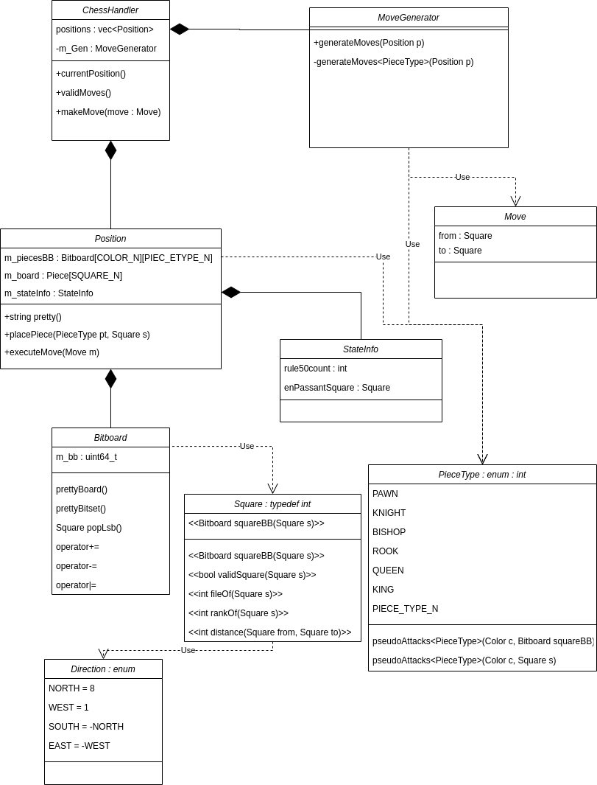

# ChessSupreme

## Configure and build
Ctrl + P -> CMake: Configure.  
Should be done when modifying CMakeLists.txt.

### Using cmake
1. Create a "build" directory in the root project folder
2. CD into the "build" directory
3. cmake ..
4. cmake --build .

### Using Visual Studio Code
- CMake: Configure (saving CMakeLists.txt will triggers this automatically)
- CMake: build

## Run
**ChessSupremeConsoleApplication**: runs interactive console application where the user gives input using the keyboard.  
**SupremeTests**: runs unittests. To disable performance tests, set the RUN_OPTIONAL_PERFORMANCE_TEST option to **OFF** in CMakeLists.txt.  
**TestBitshiftInteractive, TestPseudoAttacksInteractive**: interactive console applications used for debugging.

## Google test
### Install dependencies
sudo apt-get install libgtest-dev  
https://www.eriksmistad.no/getting-started-with-google-test-on-ubuntu/ 
### Create a new test.cpp
- Add .cpp test file in test/
- Add the new .cpp to TESTS in CMakeLists.txt
- Rebuild the project and run SupremeTests

## Class diagram
Drawio link: https://app.diagrams.net/#G1Jd-xLiLq3nyMKETKuKr7NV3GBQV7sZi  

## Some references
https://www.chessprogramming.org  
https://alexanderameye.github.io/notes/chess-engine/ 
https://github.com/official-stockfish/Stockfish